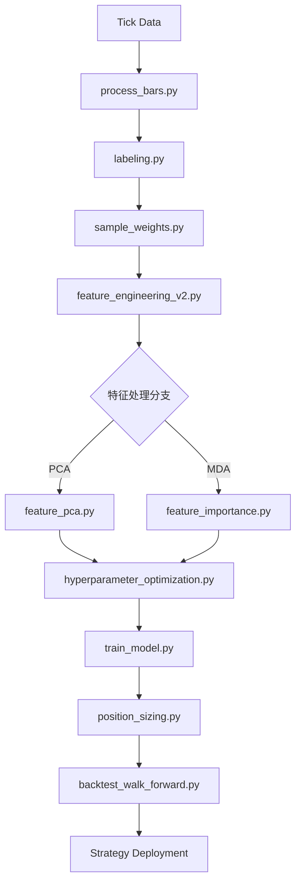

# AFML 全流程量化研发工作流

本技能提供了基于 *Advances in Financial Machine Learning* (AFML) 方法论的量化研发全流程指导。

## 核心流程

该工作流分为四个阶段，每个阶段都有具体的脚本、逻辑和评价标准。详细信息请参阅 [references/workflow_details.md](references/workflow_details.md)。

### 第一阶段：数据结构化与标注 (The Foundation)
1. **采样 (Sampling)**: 使用 Dynamic Dollar Bars。脚本: `src/process_bars.py`。
2. **标签标注 (Labeling)**: 三重障碍法 (Triple Barrier Method)。脚本: `src/labeling.py`。
3. **样本权重 (Sample Weights)**: 计算 Average Uniqueness。脚本: `src/sample_weights.py`。

### 第二阶段：特征工程与正交化 (Feature Engineering)
4. **因子生成 2.0 (Feature Generation)**: FFD, VPIN, Alpha158 等。脚本: `src/feature_engineering_v2.py`。
5. **特征处理 (Feature Selection/Reduction)**:
   - **PCA (推荐)**: 正交主成分。脚本: `src/feature_pca.py`。
   - **MDA**: 平均准确度下降。脚本: `src/feature_importance.py`。

### 第三阶段：模型调优与训练 (Model & Tuning)
6. **超参数优化 (Optimization)**: Optuna + Purged K-Fold CV。脚本: `src/hyperparameter_optimization.py`。
7. **定型训练 (Final Training)**: 元标签 (Meta-Labeling) 生产模型。脚本: `src/train_model.py`。
8. **概率头寸管理 (Position Sizing)**: Gaussian Bet Sizing。脚本: `src/position_sizing.py`。

### 第四阶段：回测与评价 (Backtesting & Evaluation)
9. **滚动回测 (Walk-Forward Backtest)**: Expanding Window 回测。脚本: `src/backtest_walk_forward.py`。

## 执行路线图 (Mermaid)

## 使用指南

- **开始新阶段前**：查阅 `references/workflow_details.md` 中的预期输出和评价标准。
- **验证结果**：在每个步骤完成后，使用工作流中定义的评价标准进行自检。
- **模型选择**：优先选择经过 PCA 处理的特征集进行训练，以减少多重共线性影响。