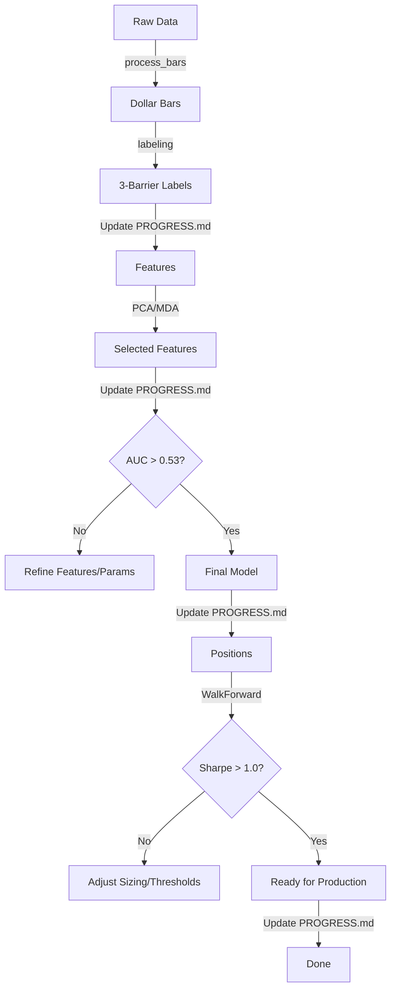

# AFML Quant R&D Workflow

This skill provides a rigorous, interactive workflow for Quantitative Research & Development based on Marcos Lopez de Prado's *Advances in Financial Machine Learning*.

## 1. Workflow Principles
- **Methodology First**: Every step must align with AFML principles (e.g., no time bars, purged CV, meta-labeling).
- **Verify Then Proceed**: Never move to the next stage without validating the current stage's output.
- **Interactive Optimization**: If metrics fail thresholds, STOP, analyze, and propose fixes to the user.
- **Progress Tracking**: **MANDATORY**. Update `PROGRESS.md` after completing each phase. Record key metrics (e.g., ADF p-value, CV AUC, Sharpe Ratio) to maintain a persistent research log.

---

## 2. Phase 1: Data & Labeling (The Foundation)

### Step 1: Sampling (Dynamic Dollar Bars)
- **Command**: `uv run python src/process_bars.py`
- **Quality Check**:
  - **Stationarity**: Check if log-returns are stationary (ADF Test p-value < 0.05).
  - **Normality**: Check Jarque-Bera statistic. Returns should approach normality compared to time bars.
- **Optimization Strategy**:
  - *Issue*: Data is non-stationary. -> *Fix*: Suggest **Fractional Differentiation (FFD)** (`src/feature_engineering_v2.py`).
  - *Issue*: Too few samples. -> *Fix*: Decrease dollar threshold.

### Step 2: Labeling (Triple Barrier)
- **Command**: `uv run python src/labeling.py`
- **Quality Check**:
  - **Class Balance**: Check distribution of {-1, 0, 1}. Classes should not be extremely skewed (<10% minority).
  - **Barrier Touch**: Ensure vertical barriers (time-outs) are not dominating (>90%) the events.
- **Optimization Strategy**:
  - *Issue*: Too many zeros. -> *Fix*: Relax barrier width (volatility multiplier) or extend vertical barrier limit.

### Step 3: Sample Weights (Uniqueness)
- **Command**: `uv run python src/sample_weights.py`
- **Quality Check**:
  - **Average Uniqueness**: Should be > 0.5. Low uniqueness implies high redundancy.

> **✅ Phase 1 Completion Action**: Update `PROGRESS.md`. Log the chosen sampling method, ADF stats, and Labeling distribution.

---

## 3. Phase 2: Feature Engineering

### Step 4 & 5: Generation & Selection
- **Command**: `uv run python src/feature_engineering_v2.py`
- **Command**: `uv run python src/feature_pca.py` (Recommended) OR `src/feature_importance.py`
- **Quality Check**:
  - **Correlation**: PCA components should be orthogonal.
  - **Information**: Top 20 features should explain significant variance.

> **✅ Phase 2 Completion Action**: Update `PROGRESS.md`. Log the feature set size (e.g., "50 PCA components explaining 95% variance") or top selected features.

---

## 4. Phase 3: Model Training & Evaluation (CRITICAL)

### Step 6: Hyperparameter Optimization
- **Command**: `uv run python src/hyperparameter_optimization.py`
- **Evaluation Criteria (The "Bar")**:
  - **Purged CV ROC-AUC**: > **0.53** (Minimum viable signal)
  - **Log Loss**: Minimizing trend.
- **INTERACTIVE OPTIMIZATION LOOP**:
  - **IF AUC < 0.53**:
    1. **STOP** and inform the user: "Model performance is below the random-guess threshold (0.53)."
    2. **Diagnose**:
       - **Overfitting**: High Train AUC (0.8+) vs Low CV AUC (0.5).
         - *Proposal*: "Increase regularization, reduce tree depth, apply stricter MDA feature selection."
       - **No Signal**: Low Train AUC (~0.5) and Low CV AUC (~0.5).
         - *Proposal*: "Feature set may be insufficient. Suggest adding Microstructure features (VPIN) or changing Labeling barriers."
    3. **Action**: Ask user, "Would you like to adjust the feature set or hyperparameters before proceeding?"

### Step 7: Final Training
- **Command**: `uv run python src/train_model.py`
- **Check**: Ensure production model matches CV performance.

> **✅ Phase 3 Completion Action**: Update `PROGRESS.md`. Log the **Best Purged CV AUC** and the best model hyperparameters.

---

## 5. Phase 4: Backtesting & Strategy (The Truth)

### Step 8: Walk-Forward Backtest
- **Command**: `uv run python src/backtest_walk_forward.py`
- **Evaluation Criteria**:
  - **Sharpe Ratio**: > **1.0** (Annualized)
  - **Probabilistic Sharpe Ratio (PSR)**: > **0.95** (95% confidence skill > 0)
  - **Deflated Sharpe Ratio (DSR)**: > **0.95** (Adjusted for multiple testing)
- **INTERACTIVE OPTIMIZATION LOOP**:
  - **IF Sharpe < 1.0**:
    1. **Analyze**:
       - *High Volatility?* -> Suggest: "Tighten **Bet Sizing** parameters or use Volatility Targeting."
       - *Low Win Rate?* -> Suggest: "Raise the **Meta-Labeling** probability threshold (e.g., min_prob from 0.5 to 0.6)."
    2. **Action**: Propose running `src/bet_sizing.py` with different parameters.

> **✅ Phase 4 Completion Action**: Update `PROGRESS.md`. Log the final **Sharpe Ratio**, **PSR**, **Max Drawdown**, and the decision (Deploy/Refine).

---

## 6. Execution Reference Map
