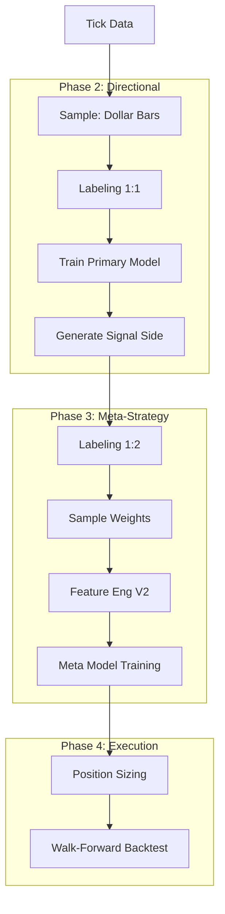

# AFML Quant R&D Workflow

This skill provides a rigorous, interactive workflow for Quantitative Research & Development based on Marcos Lopez de Prado's *Advances in Financial Machine Learning*.

## 1. Workflow Principles
- **Methodology First**: Every step must align with AFML principles (e.g., no time bars, purged CV, meta-labeling).
- **Verify Then Proceed**: Never move to the next stage without validating the current stage's output.
- **Interactive Optimization**: If metrics fail thresholds, STOP, analyze, and propose fixes to the user.
- **Progress Tracking**: **MANDATORY**. Update `PROGRESS.md` after completing each phase. Record key metrics to maintain a persistent research log.

---

## 2. Phase 1: Data & Labeling (The Foundation)

### Step 1: Sampling (Dynamic Dollar Bars)
- **Command**: `uv run python src/process_bars.py`
- **Output**: `data/output/dynamic_dollar_bars.csv`
- **Quality Check**:
  - **Stationarity**: Check if log-returns are stationary (ADF Test p-value < 0.05).
  - **Normality**: Check Jarque-Bera statistic. Returns should approach normality compared to time bars.

### Step 2: Labeling (Triple Barrier)
- **Command**: `uv run python src/labeling.py`
- **Output**: `data/output/labeled_events.csv`
- **Quality Check**:
  - **Class Balance**: Check distribution of {-1, 0, 1}.
  - **Barrier Touch**: Ensure vertical barriers (time-outs) are not dominating.

### Step 3: Sample Weights (Uniqueness)
- **Command**: `uv run python src/sample_weights.py`
- **Output**: `data/output/sample_weights.csv`
- **Quality Check**:
  - **Average Uniqueness**: Should be > 0.5. Low uniqueness implies high redundancy.

> **✅ Phase 1 Completion Action**: Update `PROGRESS.md`. Log the chosen sampling method and Labeling distribution.

---

## 3. Phase 2: Primary Directional Model (Baseline)

Goal: Build a "Baseline" model sensitive to market direction (high Recall), ignoring risk/reward ratios.

### Step 4: Symmetric Labeling
- **Command**: `uv run python src/labeling.py --pt 1 --sl 1 --suffix _primary`
- **Config**: `pt=1`, `sl=1` (Symmetric).
- **Output**: `data/output/labeled_events_primary.csv`

### Step 5: Primary Training & Signal Generation
- **Command**: `uv run python src/train_primary.py`
- **Goal**: Train a classifier for direction and generate full-history predictions (`side`).
- **Output**: `data/output/predicted_side.csv` (Contains `-1` or `1` signals).

> **✅ Phase 2 Completion Action**: Update `PROGRESS.md`. Log the Primary Model's directional accuracy/recall.

---

## 4. Phase 3: Meta-Strategy (The Core)

Goal: "Second opinion" (Meta-Labeling) on the Primary signals using a high Risk:Reward ratio (1:2).

### Step 6: Strategic Labeling
- **Command**: `uv run python src/labeling.py --pt 2 --sl 1 --side_file data/output/predicted_side.csv`
- **Logic**: Label `1` ONLY if Primary Signal is correct AND price moves 2x volatility. Otherwise `0`.
- **Output**: `data/output/labeled_events_meta.csv`

### Step 7: Meta-Features & Weights
- **Sample Weights**: `uv run python src/sample_weights.py` (Use meta events).
- **Feature Engineering**: `uv run python src/feature_engineering_v2.py`
  - **Crucial**: Include `prob_primary` (Primary Model's confidence) as a feature.

### Step 8: Meta-Model Training
- **Command**: `uv run python src/train_model.py`
- **Evaluation Criteria**:
  - **Purged CV ROC-AUC**: > **0.55** (Higher bar for meta-model).
- **Interactive Optimization**:
  - If AUC < 0.55: Suggest Feature Engineering (PCA, MDA) or Hyperparameter Tuning.

> **✅ Phase 3 Completion Action**: Update `PROGRESS.md`. Log the **Best Purged CV AUC** and hyperparameters.

---

## 5. Phase 4: Execution & Backtest

### Step 9: Position Sizing
- **Command**: `uv run python src/position_sizing.py`
- **Logic**: $Size = Proba 	imes (Target \\\ Volatility)$ based on Meta-Model confidence.

### Step 10: Walk-Forward Backtest
- **Command**: `uv run python src/backtest_walk_forward.py`
- **Logic**: Simulate dual signal flow: Tick -> Primary -> Side -> Meta -> Decision.
- **Evaluation Criteria**:
  - **Sharpe Ratio**: > **1.0**
  - **PSR/DSR**: > **0.95**

> **✅ Phase 4 Completion Action**: Update `PROGRESS.md`. Log final **Sharpe Ratio**, **PSR**, **Max Drawdown**, and Decision.

---

## 6. Execution Reference Map

