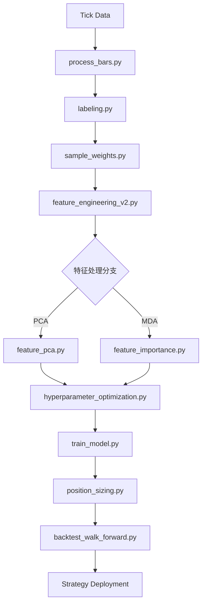

# 🛠️ AFML 全流程量化研发工作流 (End-to-End)

本工作流旨在通过严谨的金融机器学习方法，将原始数据转化为可实盘验证的量化策略。基于 *Advances in Financial Machine Learning* (AFML) 方法论构建。

## 第一阶段：数据结构化与标注 (The Foundation)

### 1. 采样 (Sampling)
*   **脚本**: `uv run python src/process_bars.py`
*   **核心逻辑**: 摒弃时间条（Time Bars），使用 **Dynamic Dollar Bars**。
*   **预期输出**: `data/output/dynamic_dollar_bars.csv`
*   **评价标准**: Jarque-Bera 统计量显著下降，收益率分布更接近正态分布。

### 2. 标签标注 (Labeling)
*   **脚本**: `uv run python src/labeling.py`
*   **核心逻辑**: **Triple Barrier Method**（三重障碍法）。
*   **预期输出**: `data/output/labeled_events.csv`
*   **评价标准**: 观察标签分布（-1, 0, 1）是否平衡；平均持仓时间是否符合预期。

### 3. 样本权重 (Sample Weights)
*   **脚本**: `uv run python src/sample_weights.py`
*   **核心逻辑**: 计算 **Average Uniqueness**，解决样本重叠导致的 IID 假设失效。
*   **预期输出**: `data/output/sample_weights.csv`
*   **评价标准**: 平均唯一性 (Uniqueness) > 0.5；权重分布能反映收益归因。

---

## 第二阶段：特征工程与正交化 (Feature Engineering)

### 4. 因子生成 2.0 (Feature Generation)
*   **脚本**: `uv run python src/feature_engineering_v2.py`
*   **核心逻辑**: 集成 Alpha158、**FFD (分数阶差分)**、微观结构 (VPIN) 和信号强度因子。
*   **预期输出**: `data/output/features_v2_labeled.csv`
*   **评价标准**: 特征维度应在 200+，涵盖量、价、波动率及知情交易信息。

### 5. 特征处理分支 (Feature Selection / Reduction)
*   **分支 A (推荐)**: `uv run python src/feature_pca.py`
    *   **预期输出**: `data/output/features_pca.csv`
    *   **评价**: 50 个左右的正交主成分，保留 95% 解释方差。
*   **分支 B**: `uv run python src/feature_importance.py`
    *   **预期输出**: `data/output/selected_features_v2.csv`
    *   **评价**: 通过 MDA (平均准确度下降) 筛选出正贡献特征。

---

## 第三阶段：模型调优与训练 (Model & Tuning)

### 6. 超参数优化 (Optimization)
*   **脚本**: `uv run python src/hyperparameter_optimization.py`
*   **核心逻辑**: 使用 **Optuna** 结合 **Purged K-Fold CV**。
*   **输入**: 上一阶段选择的特征集（推荐 PCA）。
*   **预期输出**: `data/output/best_hyperparameters.csv`
*   **评价标准**: Purged CV ROC AUC > 0.53；Optuna 优化曲线收敛。

### 7. 定型训练 (Final Training)
*   **脚本**: `uv run python src/train_model.py`
*   **核心逻辑**: 训练包含元标签 (Meta-Labeling) 的生产模型。
*   **预期输出**: 最终模型文件及 `feature_importance_optimized.csv`。
*   **评价标准**: OOS (样本外) 指标稳定，特征归因符合金融逻辑。

### 7.5 概率头寸管理 (Probabilistic Position Sizing)
*   **脚本**: `uv run python src/position_sizing.py`
*   **核心逻辑**: 基于 AFML Chapter 10，将模型概率转换为仓位大小。
    - **Gaussian Bet Sizing**: 使用 z = (p - 0.5) / σ_p，通过 CDF 映射到 [-1, 1]
    - **Concurrency Scaling**: 使用 `avg_uniqueness` 缩减重叠仓位
*   **预期输出**: `data/output/position_sizes.csv`
*   **评价标准**: 
    - 仓位分布呈现 Sigmoid-like 形态
    - 高置信度交易 (p > 0.7) 获得接近 1.0 的仓位
    - 低置信度交易 (p ≈ 0.5) 仓位接近 0

---

## 第四阶段：回测与评价 (Backtesting & Evaluation)

### 8. 滚动回测 (Walk-Forward Backtest)
*   **脚本**: `uv run python src/backtest_walk_forward.py`
*   **核心逻辑**: 模拟真实交易，动态更新模型，进行 Expanding Window 回测。
*   **预期输出**: `visual_analysis/backtest_walk_forward.png`
*   **评价标准**: 
    - **Sharpe Ratio > 1.0** (关键指标)
    - **Probabilistic Sharpe Ratio (PSR) > 0.95**
    - **Max Drawdown < 15%**

---

## 🧭 执行流程图

---
**Skill Usage List:**
- `afml skill`: Methodology following AFML Chapter 3-10.
- `mlfinlab skill`: Pipeline structure inspired by mlfinlab.
- `quant-rd-rules`: Adhering to project tracking and R&D standards.
