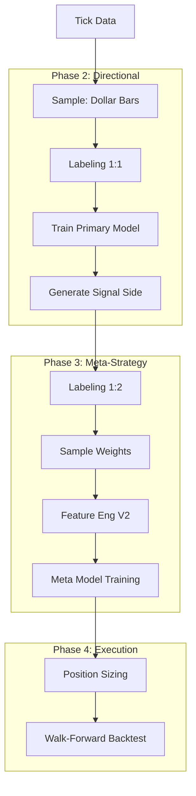

# 🛠️ AFML 全流程量化研发工作流 (End-to-End)

本工作流旨在通过严谨的金融机器学习方法，将原始数据转化为可实盘验证的量化策略。基于 *Advances in Financial Machine Learning* (AFML) 方法论构建。

## 第一阶段：数据结构化与标注 (The Foundation)

### 1. 采样 (Sampling)
*   **脚本**: `uv run python src/process_bars.py`
*   **核心逻辑**: 摒弃时间条（Time Bars），使用 **Dynamic Dollar Bars**。
*   **预期输出**: `data/output/dynamic_dollar_bars.csv`
*   **评价标准**: Jarque-Bera 统计量显著下降，收益率分布更接近正态分布。

### 2. 标签标注 (Labeling)
*   **脚本**: `uv run python src/labeling.py`
*   **核心逻辑**: **Triple Barrier Method**（三重障碍法）。
*   **预期输出**: `data/output/labeled_events.csv`
*   **评价标准**: 观察标签分布（-1, 0, 1）是否平衡；平均持仓时间是否符合预期。

### 3. 样本权重 (Sample Weights)
*   **脚本**: `uv run python src/sample_weights.py`
*   **核心逻辑**: 计算 **Average Uniqueness**，解决样本重叠导致的 IID 假设失效。
*   **预期输出**: `data/output/sample_weights.csv`
*   **评价标准**: 平均唯一性 (Uniqueness) > 0.5；权重分布能反映收益归因。

---

## 第二阶段：基准模型构建 (Phase 2: Primary Directional Model)

此阶段目标是构建一个对市场方向敏感的“基准模型” (Baseline)，不考虑具体盈亏比，只关注方向预测准确率。

### 2a. 对称标注 (Symmetric Labeling)
*   **脚本**: `uv run python src/labeling.py --pt 1 --sl 1 --suffix _primary`
*   **配置**: `pt_sl = [1, 1]`。使用对称障碍，最大化捕捉市场波动规律，避免盈亏比偏好扭曲训练数据。
*   **预期输出**: `data/output/labeled_events_primary.csv`

### 2b. 基模型训练与信号生成 (Primary Training)
*   **脚本**: `uv run python src/train_primary.py` (需创建)
*   **核心逻辑**: 训练一个高 Recall 的分类器，并对历史数据生成全量预测信号 (`side`)。
*   **输入**: 基础特征集 + 1:1 标签。
*   **预期输出**: `data/output/predicted_side.csv` (包含由模型判断的 `-1` 或 `1` 方向)。

---

## 第三阶段：元策略构建 (Phase 3: Meta-Strategy)

此阶段是核心。利用 Baseline 判断的方向，在 1:2 的高盈亏比下进行“二次审核” (Meta-Labeling)。

### 3a. 策略标注 (Strategic Labeling)
*   **脚本**: `uv run python src/labeling.py --pt 2 --sl 1 --side_file data/output/predicted_side.csv`
*   **核心逻辑**: 
    1. 读取基模型的预测方向作为 `side`。
    2. 设置 **Risk:Reward = 1:2** (`pt`=2, `sl`=1)。
    3. 只有当基模型看涨且随后价格真涨了 2 倍波动率，才标记为 `1`；否则为 `0`。
*   **预期输出**: `data/output/labeled_events_meta.csv`

### 3b. 样本权重 (Sample Weights)
*   **脚本**: `uv run python src/sample_weights.py`
*   **输入**: 使用 Meta 阶段的 `labeled_events_meta.csv`。

### 3c. 特征工程 (Feature Engineering)
*   **脚本**: `uv run python src/feature_engineering_v2.py`
*   **核心**: 将基模型的预测概率 (`prob_primary`) 也加入作为特征之一。

### 3d. 元模型训练 (Meta-Model Training)
*   **脚本**: `uv run python src/train_model.py`
*   **模型**: LightGBM 或 RandomForest。
*   **目标**: 预测“基模型这次是否靠谱”。
*   **评价**: Purged CV ROC-AUC > 0.55。

---

## 第四阶段：实盘部署与回测 (Phase 4: Execution)

### 4a. 概率头寸管理 (Position Sizing)
*   **脚本**: `uv run python src/position_sizing.py`
*   **核心逻辑**: 
    - 结合 Meta Model 的置信度 ($p$) 和 1:2 的赔率。
    - $Size = Proba \times (Target \ Volatility)$

### 4b. 滚动回测 (Walk-Forward)
*   **脚本**: `uv run python src/backtest_walk_forward.py`
*   **核心**: 模拟双层信号流： Tick -> Primary(1:1) -> Side -> Meta(1:2) -> Decision。

---

## 🧭 执行流程图

---
**Skill Usage List:**
- `afml skill`: Methodology following AFML Chapter 3-10.
- `mlfinlab skill`: Pipeline structure inspired by mlfinlab.
- `quant-rd-rules`: Adhering to project tracking and R&D standards.
