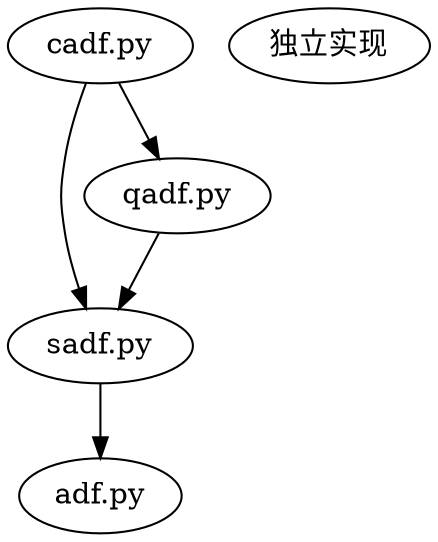

# 结构突变特征设计文档

## 概述

为 AFMLKit 的 FeatureKit 添加 6 个结构突变特征（AFML 第 17 章），用于检测金融时间序列中的泡沫、爆炸性行为和趋势突变。

### 实现范围

| 特征 | 状态 | 数据需求 |
|------|------|---------|
| SADF (Supremum ADF) | 实现 | K 线数据 |
| QADF (Quantile ADF) | 实现 | K 线数据 |
| CADF (Conditional ADF) | 实现 | K 线数据 |
| Sub-Martingale Test | 实现 | K 线数据 |
| Super-Martingale Test | 实现 | K 线数据 |
| Kyle's Lambda 等 4 个 | 不实现 | 需要逐笔数据 |

## 目录结构

```
afmlkit/feature/core/structural_break/
├── __init__.py    # 统一导出
├── adf.py         # ADF 基础函数
├── sadf.py        # SADF
├── qadf.py        # QADF
├── cadf.py        # CADF
├── smt.py         # SMT (Sub/Super-Martingale)
└── cusum.py       # 已有
```

## API 层次设计

每个特征提供三层 API：

1. **Numba 核心函数**（`_xxx_core`）：高性能计算，内部使用
2. **公开函数**（`xxx_test`）：用户友好的函数式 API
3. **Transform 类**（`XXXTest`）：支持 FeatureKit 流水线

---

## 第一节：ADF 核心实现 (adf.py)

### 算法原理

ADF (Augmented Dickey-Fuller) 检验用于检测单位根。回归方程：

```
Δy_t = α + βt + γy_{t-1} + Σ δ_i Δy_{t-i} + ε_t
```

原假设 H₀：γ = 0（存在单位根，非平稳）

### 函数签名

```python
# Numba 核心
@njit(nogil=True)
def _ols_coefficients(X: NDArray[np.float64], y: NDArray[np.float64]) -> Tuple[NDArray, NDArray]:
    """OLS 回归，返回 (coefficients, residuals)，使用 QR 分解"""

@njit(nogil=True)
def _adf_regression_core(
    y: NDArray[np.float64],
    max_lag: int,
    trend: bool = True
) -> Tuple[float, float]:
    """核心 ADF 回归，返回 (t_statistic, p_value_approx)"""

# 公开 API
def adf_test(
    y: Union[pd.Series, NDArray[np.float64]],
    max_lag: int = 12,
    trend: bool = True,
    use_numba: bool = True
) -> Tuple[float, float, int]:
    """
    单次 ADF 检验
    :returns: (t_statistic, p_value, selected_lag)
    """

def adf_test_rolling(
    y: Union[pd.Series, NDArray[np.float64]],
    window: int,
    max_lag: int = 12,
    trend: bool = True,
    use_numba: bool = True
) -> NDArray[np.float64]:
    """滚动 ADF 检验，返回每个时间点的 t 统计量"""
```

### 混合模式实现

| 部分 | 实现方式 | 原因 |
|------|---------|------|
| OLS 回归 | Numba `@njit` | 高频调用 |
| 滚动循环 | Numba `@njit` | 外层循环加速 |
| 滞后阶选择 (AIC) | numpy | 逻辑复杂 |
| p_value 近似 | numpy 查表 | MacKinnon 表查值 |

### MacKinnon 临界值表

```python
_MACKINNON_APPROX = {
    'with_trend': {
        25: (-4.38, -3.60, -3.24),
        50: (-4.15, -3.50, -3.18),
        100: (-4.04, -3.45, -3.15),
        ...
    },
    'no_trend': {
        25: (-3.75, -3.00, -2.63),
        ...
    }
}
```

---

## 第二节：SADF 实现 (sadf.py)

### 算法原理

SADF (Supremum ADF) 在每个时间点遍历多个窗口，取 ADF 统计量的上确界：

```
SADF_t = sup{ ADF_t(r₀, r) : r ∈ [r₀, 1] }
```

物理意义：检测任何窗口内的爆炸性行为（泡沫）。

### 函数签名

```python
@njit(nogil=True)
def _sadf_core(
    log_prices: NDArray[np.float64],
    min_window: int,
    max_window: int,
    max_lag: int,
    trend: bool
) -> NDArray[np.float64]:
    """
    SADF 核心计算
    :returns: SADF 统计量序列（前 min_window 个为 NaN）
    """

def sadf_test(
    prices: Union[pd.Series, NDArray[np.float64]],
    min_window: int = 20,
    max_window: int = 100,
    max_lag: int = 12,
    trend: bool = True,
    use_log: bool = True,
    use_numba: bool = True
) -> Union[pd.Series, NDArray[np.float64]]:
    """SADF 检验"""

class SADFTest(SISOTransform):
    """SADF Transform"""
    def __init__(
        self,
        min_window: int = 20,
        max_window: Optional[int] = 100,
        max_lag: int = 12,
        trend: bool = True,
        use_log: bool = True
    ): ...
```

### 关键参数

| 参数 | 默认值 | 说明 |
|------|--------|------|
| `min_window` | 20 | 最小窗口大小 |
| `max_window` | 100 | 最大窗口（None 为扩张窗口） |
| `use_log` | True | 对价格取对数（推荐） |

---

## 第三节：QADF 实现 (qadf.py)

### 算法原理

QADF (Quantile ADF) 对 SADF 序列取滚动高分位数，减少噪声：

```
QADF_t(q) = Quantile(SADF_{t-L:t}, q)
```

### 函数签名

```python
@njit(nogil=True)
def _rolling_quantile_core(
    x: NDArray[np.float64],
    window: int,
    quantile: float
) -> NDArray[np.float64]:
    """滚动分位数计算"""

def qadf_test(
    sadf_values: Union[pd.Series, NDArray[np.float64]],
    window: int = 20,
    quantile: float = 0.95,
    use_numba: bool = True
) -> Union[pd.Series, NDArray[np.float64]]:
    """QADF 检验"""

class QADFTest(MISOTransform):
    """
    QADF Transform
    :param precompute_sadf: 是否内部预计算 SADF
    :param sadf_params: SADF 参数（若 precompute_sadf=True）
    """
```

---

## 第四节：CADF 实现 (cadf.py)

### 算法原理

CADF (Conditional ADF) 计算高 ADF 值的条件期望：

```
CADF_t(q, L) = E[ADF_t | ADF_t > QADF_{t-L:t}(q)]
```

物理意义：量化泡沫的平均强度。

### 函数签名

```python
@njit(nogil=True)
def _conditional_expectation_core(
    adf_values: NDArray[np.float64],
    quantile_values: NDArray[np.float64],
    window: int
) -> NDArray[np.float64]:
    """
    条件期望计算
    注意：window 应与 QADF 的滚动窗口一致
    若无条件样本，返回 np.nan
    """

def cadf_test(
    prices: Union[pd.Series, NDArray[np.float64]],
    sadf_values: Optional[...] = None,
    qadf_values: Optional[...] = None,
    min_window: int = 20,
    max_window: int = 100,
    quantile_window: int = 20,
    quantile: float = 0.95,
    max_lag: int = 12,
    use_numba: bool = True
) -> Union[pd.Series, NDArray[np.float64]]:
    """CADF 检验，支持注入预计算的 SADF/QADF"""

class CADFTest(MISOTransform):
    """CADF Transform，支持注入外部 SADF/QADF"""
    def __init__(
        self,
        min_window: int = 20,
        max_window: int = 100,
        quantile_window: int = 20,
        quantile: float = 0.95,
        max_lag: int = 12,
        sadf_values: Optional[NDArray[np.float64]] = None,
        qadf_values: Optional[NDArray[np.float64]] = None
    ): ...
```

### 关键设计决策

| 决策 | 选择 | 理由 |
|------|------|------|
| 注入模式 | `sadf_values`/`qadf_values` 参数 | 支持缓存复用 |
| 参数过载 | 加 `UserWarning` | 提醒用户被忽略的参数 |
| window 耦合 | docstring 明确说明 | 数学一致性 |
| fallback | 返回 `np.nan` | 明确表示缺失 |

---

## 第五节：SMT 实现 (smt.py)

### 算法原理

Sub-/Super-Martingale 检验用于检测趋势：

**Sub-Martingale**（检测上涨）：
```
H₀: E[P_{t+1} | P_t, ..., P_1] ≤ P_t
```

**检验统计量**：
$$S_t = \frac{\sum w_i \cdot r_i}{\sqrt{\sum w_i^2}}$$

其中 $w_i = \lambda^{t-i}$（未归一化指数权重）。

### 函数签名

```python
@njit(nogil=True)
def _sub_martingale_core(
    prices: NDArray[np.float64],
    decay: float,
    window_size: int  # -1 表示扩张窗口
) -> NDArray[np.float64]:
    """
    亚鞅检验核心
    数学公式：S_t = Σ w_i · r_i / √(Σ w_i²)
    """

@njit(nogil=True)
def _super_martingale_core(
    prices: NDArray[np.float64],
    decay: float,
    window_size: int
) -> NDArray[np.float64]:
    """超鞅检验核心，返回 -sub_martingale"""

def sub_martingale_test(
    prices: Union[pd.Series, NDArray[np.float64]],
    decay: float = 0.95,
    window: Optional[int] = None,
    use_numba: bool = True
) -> Union[pd.Series, NDArray[np.float64]]:
    """亚鞅检验（检测上涨趋势）"""

def super_martingale_test(...) -> ...:
    """超鞅检验（检测下跌趋势）"""

def martingale_test(...) -> Tuple[..., ...]:
    """同时返回亚鞅和超鞅检验"""

class SubMartingaleTest(SISOTransform): ...
class SuperMartingaleTest(SISOTransform): ...
class MartingaleTest(SIMOTransform):
    """输出两列：['sub_martingale', 'super_martingale']"""
```

### 关键设计决策

| 决策 | 选择 | 理由 |
|------|------|------|
| Numba 参数 | 拆分函数，避免 `str` | Numba 兼容性 |
| `Optional[int]` | 用 -1 表示扩张窗口 | Numba 兼容性 |
| 公式选择 | 原始公式（未归一化权重） | 统计意义清晰 |
| 数值保护 | 分母 < 1e-10 返回 NaN | 防止零除 |

### decay 参数与持有期

```
半衰期 ≈ 0.693 / ln(decay)

decay = 0.95 → 半衰期 ≈ 13.5 期
decay = 0.90 → 半衰期 ≈ 6.6 期
decay = 0.99 → 半衰期 ≈ 69 期
```

---

## 第六节：测试策略

### 测试文件结构

```
tests/feature/core/structural_break/
├── test_adf.py          # ADF 基础函数测试
├── test_sadf.py         # SADF 测试
├── test_qadf.py         # QADF 测试
├── test_cadf.py         # CADF 测试
├── test_smt.py          # SMT 测试
└── test_integration.py  # 集成测试
```

### 测试要点

| 模块 | 关键测试 |
|------|---------|
| ADF | 单位根 vs 平稳过程、趋势项影响 |
| SADF | 泡沫检测、输出形状、NaN 位置 |
| QADF | 分位数性质、平滑度 |
| CADF | 参数注入、fallback 行为 |
| SMT | 上涨/下跌/随机游走、decay 影响 |

---

## 使用示例

```python
from afmlkit.feature.core.structural_break import (
    sadf_test, qadf_test, cadf_test, martingale_test,
    SADFTest, CADFTest, MartingaleTest,
)

# 泡沫检测
sadf = sadf_test(df['close'], min_window=20, max_window=100)
bubble_signal = sadf > 1.5

# 稳健泡沫检测
cadf = CADFTest(min_window=20, max_window=100).transform(df[['close']])

# 趋势检测
sub, sup = martingale_test(df['close'], decay=0.95)
```

---

## 不实现的特征

以下 4 个特征需要逐笔成交/订单流数据，暂不实现：

| 特征 | 数据需求 |
|------|---------|
| Kyle's Lambda | 逐笔订单流 |
| Hasbrouck's Lambda | 逐笔成交 |
| PIN | 买卖单量 |
| Tick Rule | 逐笔成交价格 |

---

## 依赖关系



---

## 实现计划

详见后续 implementation plan。